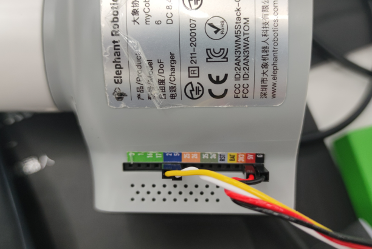
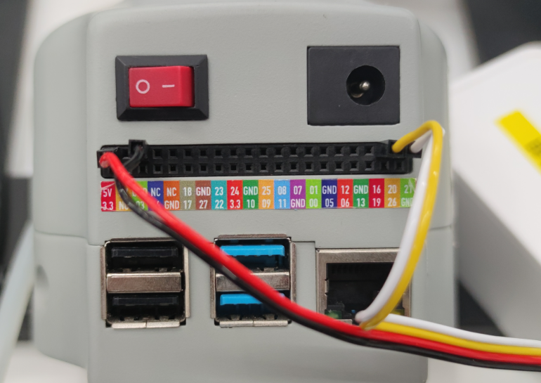

# Documentation

## 测试说明

### Test 1 Camera
测试相机功能是否正常， 正常情况应该类似图上情况

**注意：你看到的画面应该是相机自己的主视角方向;即相机显示在`BGR Frame`上左边的内容，在现实中也应该在相机的左边**

如果显示异常，前往奥比官网下载OrbbecViewer进一步查看情况

### Test 2 Aruco

测试Anchor Aruco的摆放是否正确，正确摆放方式应该如图所示

**两个ID为0的Aruco，分别将自身的左上角对准识别平面的左上角和右下角，通过画面上的数字判断ID，红点表示Aruco的左上角角点**

### Test 3 Crop

测试根据Aruco切割的效果

成功效果示例

### Test 4 Detect Object

测试切割后的画面内的Aruco识别效果

成功效果示例

如果失败，请检查Test3的情况

### Test 5 Detect Object Depth

测试切割以后的画面内的Aruco的识别，计算其深度，并选择一个**最高**的目标展示在屏幕上

成功效果示例

注：这个测试项也可以用来校准`config`中的`floor_depth`项

### Test 6 Serial Port

测试本机可用的串口

Windows系统上得到的串口号大多形如COM+数字的形式，比如`COM6`
Linux系统上得到的串口号大多形如`/dev/ttyXXX`的形式，比如`/dev/ttyAMA0`

得到串口信息后更新到config.py中的`arm_serial_port`

### Test 7 Robot Coord Calc

测试机械臂点位计算的精度

运行这个脚本以后，机械臂应该将末端移动至平面中心点（附近即可）

成功效果示例

### Test 8 Pump

测试吸泵连线是否正常

运行这个脚本以后，机械臂会先启动吸泵，三秒钟后关闭吸泵

观察吸泵运行情况即可，如果有误请检查吸泵连线

## 连线方式
### M5版本

吸泵连接方式
(红, 黑, 黄, 白) -> (5V, GND, 2, 5)

### Pi版本

(红, 黑, 黄, 白) -> (5V, GND, 20, 21)

