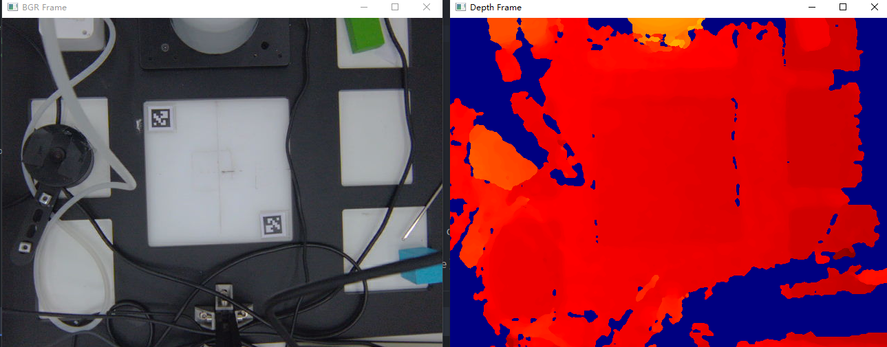
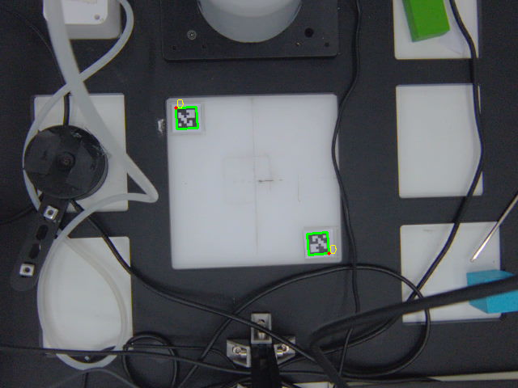
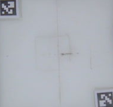
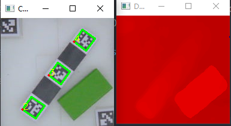
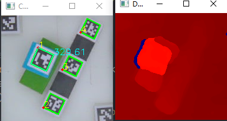
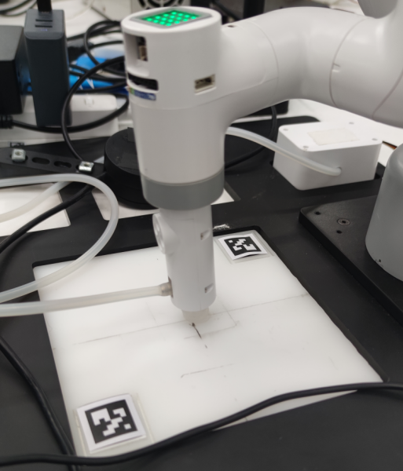

# Documentation

## 测试说明

### Test 1 Camera
测试相机功能是否正常， 正常情况应该类似图上情况



**注意：你看到的画面应该是相机自己的主视角方向;即相机显示在`BGR Frame`上左边的内容，在现实中也应该在相机的左边**

### Test 2 Aruco

测试Anchor Aruco的摆放是否正确，正确摆放方式应该如图所示

**两个ID为0的Aruco，分别将自身的左上角对准识别平面的左上角和右下角，通过画面上的数字判断ID，红点表示Aruco的左上角角点**



### Test 3 Crop

测试根据Aruco切割的效果

成功效果示例



### Test 4 Detect Object

测试切割后的画面内的Aruco识别效果

成功效果示例



### Test 5 Detect Object Depth

测试切割以后的画面内的Aruco的识别，计算其深度，并选择一个**最高**的目标展示在屏幕上

成功效果示例



### Test 6 Robot Coord Calc

测试机械臂点位计算的精度

运行这个脚本以后，机械臂应该将末端移动至平面中心点（附近即可）

成功效果示例



## 文件结构说明
```shell
.
├── .gitignore
├── README.md
├── core
│   ├── __init__.py
│   ├── arm_controls.py 机械臂控制的简单封装
│   ├── aruco_detector.py aruco识别器和相关可视化函数
│   ├── camera.py 奥比相机的简单封装
│   ├── config.py 配置参数
│   ├── coord_calc.py 参数转换计算
│   └── utils.py 各种工具
├── docs
│   ├── .doc_images
│   └── doc.md 文档
├── main.py
├── reqiurements.txt
└── tests
    ├── test1_camera.py
    ├── test2_aruco.py
    ├── test3_crop.py
    ├── test4_show_detect.py
    ├── test5_detect_object_depth.py
    └── test6_robot_coord_calc.py
```


